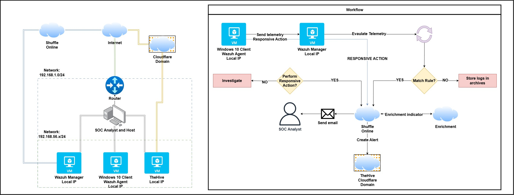

<h1 id="-building-a-zero-touch-soc-end-to-end-automation-with-wazuh-shuffle-and-thehive">🛡️ Building a Zero-Touch SOC: End-to-End Automation with Wazuh, Shuffle, and TheHive</h1>

Hi everyone! I'm excited to share the architecture and automation pipeline of my custom Security Operations Center (SOC) home lab.

<h2 id="project-overview">Project Overview</h2>

This project uses a fully open-source stack to demonstrate powerful automation capabilities: detecting a threat, enriching the evidence with threat intelligence, and automatically generating an actionable alert for an analyst. My approach solves a key challenge for hybrid cloud/local labs by using <strong>Cloudflare Tunnel</strong> to securely connect a cloud-based SOAR platform to my local VMs.

The components used are all open source and incredibly powerful, rivaling solutions used by large enterprises.

<h3 id="the-core-technologies">The Core Technologies</h3>
<table role="table">
<thead>
<tr>
<th>Component</th>
<th>Role in the LAB</th>
<th>Details</th>
</tr>
</thead>
<tbody>
<tr>
<td><strong>Wazuh</strong></td>
<td><strong>SIEM/XDR</strong></td>
<td>Central log processing, custom rule detection (Mimikatz), and webhook triggering.</td>
</tr>
<tr>
<td><strong>Shuffle</strong></td>
<td><strong>SOAR</strong></td>
<td>The automation brain. Handles data parsing (Regex), VirusTotal enrichment, and API calls to TheHive.</td>
</tr>
<tr>
<td><strong>TheHive</strong></td>
<td><strong>IRP</strong></td>
<td>Incident and Case Management solution. Receives structured, enriched alerts.</td>
</tr>
<tr>
<td><strong>VirusTotal</strong></td>
<td><strong>Threat Intel</strong></td>
<td>Provides enrichment for extracted file hashes via the v3 API.</td>
</tr>
<tr>
<td><strong>Cloudflare Tunnel</strong></td>
<td><strong>Secure Connectivity</strong></td>
<td>Crucial component to expose the local TheHive API to Shuffle Cloud without opening firewall ports.</td>
</tr>
<tr>
<td><strong>Endpoints</strong></td>
<td><strong>Telemetry Source</strong></td>
<td>Windows 10/11 VM running <strong>Sysmon</strong> (Event ID 1 process creation logging).</td>
</tr>
</tbody>
</table>

    
     
    <small>SOC Automation Logical Diagram</small>

<h2 id="-my-soc-lab-architecture">💻 My SOC LAB Architecture</h2>

My entire lab uses <strong>VirtualBox</strong> for all VMs, creating a fully isolated, stable, and reproducible environment.

<h3 id="network-configuration">Network Configuration</h3>

All components are behind a VirtualBox NAT network, allowing all machines access to the internet, while their local IPs are not directly exposed.

<table role="table">
<thead>
<tr>
<th>Component</th>
<th>Virtual IP (Internal)</th>
<th>Host Connectivity</th>
</tr>
</thead>
<tbody>
<tr>
<td>Wazuh Manager - Linux Virtual Machine</td>
<td><code>192.168.56.105 (Static IP)</code></td>
<td>Listens for agents on standard ports (1514/1515).</td>
</tr>
<tr>
<td>TheHive - Linux Virtual Machine</td>
<td><code>192.168.56.103 (Static IP)</code></td>
<td>API exposed securely via <strong>Cloudflare Tunnel</strong>.</td>
</tr>
<tr>
<td>Windows Endpoint - Windows 10 Virtual Machine</td>
<td><code>192.168.56.100 (Static IP)</code></td>
<td>Runs Wazuh Agent + Sysmon.</td>
</tr>
<tr>
<td>Analyst Machine - Windows 11</td>
<td><code>192.168.1.xx (DHCP)</code> (Host)</td>
<td>Used for management and simulating the analyst's workstation.</td>
</tr>
</tbody>
</table>

    
     
    <small>VirtualBox Setup for All Lab Components</small>

<h3 id="the-cloud-bridge-cloudflare-tunnel">The Cloud Bridge: Cloudflare Tunnel</h3>

This is a critical security detail. Since <strong>Shuffle Cloud</strong> cannot reach my private network (<code>192.168.56.103</code>), the <strong>Cloudflare Tunnel</strong> agent was installed on TheHive VM. This agent creates an <strong>outbound encrypted tunnel</strong> to Cloudflare, making TheHive reachable by Shuffle via a public hostname (<code>https://thehive.mydomain.com/</code>), while keeping my firewall closed. I attempted hosting Shuffle via the virtual environment, however I quickly reached my host machine's memory limitations, therefore the tunnel solution was more reachable and logical to complete the project.
 

<h2 id="-automation-workflow-mimikatz-detection">🚀 Automation Workflow: Mimikatz Detection</h2>

The workflow demonstrates a classic SOC automation use case, from endpoint telemetry to actionable triage data.

<h3 id="detection-scenario">Detection Scenario</h3>

A user executes Mimikatz on the Windows Endpoint.

<ul>
<li><strong>Endpoint &rarr; Wazuh:</strong> Sysmon captures Event ID 1 (Process Creation). The Wazuh Agent forwards the log to the Manager.</li>
<li><strong>Wazuh Alert:</strong> A custom rule (e.g., Rule ID 100002) triggers on the original file name/process command line, generating a high-severity alert.</li>
<li><strong>Wazuh &rarr; Shuffle:</strong> Wazuh uses its integration framework to send the full, decoded alert JSON via <strong>Webhook</strong> to Shuffle Cloud.</li>
</ul>

    
     
    <small>Wazuh Discovery Dashboard Showing Endpoint Telemetry</small>

<h3 id="shuffle-soar-playbook">Shuffle SOAR Playbook</h3>

The Shuffle workflow executes the following steps:

<table role="table">
<thead>
<tr>
<th>Step</th>
<th>Action</th>
<th>Output Data</th>
</tr>
</thead>
<tbody>
<tr>
<td>A. Artifact Extraction</td>
<td><strong>Regex Capture Group</strong> with pattern <code>SHA256=([A-Fa-f0-9]{64})</code></td>
<td>Clean SHA256 Hash string.</td>
</tr>
<tr>
<td>B. Threat Enrichment</td>
<td><strong>VirusTotal v3 API</strong> action (<code>get_a_hash_report</code>)</td>
<td>Comprehensive analysis and malicious vendor count.</td>
</tr>
<tr>
<td>C. Incident Creation</td>
<td><strong>TheHive API POST</strong> (<code>/api/v1/alert</code>)</td>
<td>Alert created using dynamically populated fields (<code>$exec.title</code>, <code>$exec.severity</code>).</td>
</tr>
<tr>
<td>D. Analyst Notification</td>
<td><strong>Email Action</strong></td>
<td>Send a summary email with the hostname, rule ID, and initial VT score.</td>
</tr>
</tbody>
</table>

    
     
    <small>The Final Alert in TheHive Management UI (Before Enrichment)</small>

<h3 id="key-solution-thehive-json-typing">Key Solution: TheHive JSON Typing</h3>

During development, TheHive frequently returned <code>Invalid json</code> or <code>BadRequest</code> errors. The solution was ensuring that <strong>severity</strong>, <strong>tlp</strong> (Traffic Light Protocol), and <strong>pap</strong> (Permissible Action Protocol) were passed as <strong>numeric integers</strong>, not strings, preventing common schema validation failures.

    
     
    <small>Complete End-to-End Shuffle Workflow Graph</small>

<h2 id="-final-working-state--potential-for-active-response">✅ Final Working State &amp; Potential for Active Response</h2>

This pipeline currently executes end-to-end flawlessly: an alert triggers, is enriched, and successfully creates a valid alert in TheHive via the secure Cloudflare tunnel connection.

The real power of this architecture lies in its potential for <strong>Active Response</strong>.

<h3 id="future-enhancement-conditional-containment">Future Enhancement: Conditional Containment</h3>

Similar to other advanced open-source labs, I plan to add a branch to the Shuffle playbook:

<ul>
<li><strong>Condition:</strong> Check the result of the VirusTotal lookup. If <code>$virustotal.malicious</code> is greater than 5, proceed to containment.</li>
<li><strong>Containment Action:</strong> Shuffle would send a response back to <strong>Wazuh's API</strong>, triggering a pre-defined <strong>Active Response Rule</strong>.</li>
<li><strong>Wazuh Action:</strong> The Manager sends a command to the Wazuh Agent on the infected Windows Endpoint to execute a local script (e.g., using PowerShell or an EDR utility) to <strong>isolate the host</strong> or <strong>delete the malicious file</strong>.</li>
</ul>

This transforms the lab from an alerting system into a <strong>fully automated detection and containment system</strong>, the ultimate goal of SOC automation, but this is in my future plans.

